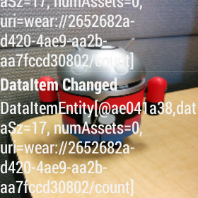

Wear HR Streamer
========================

This project facilitates the data flow from Wear OS to Android and ultimately to Unity. Data communication from Wear OS to Android is achieved via the DataLayer API using BLE, while data transmission from Android to Unity is handled through the Lab Stream Layer (LSL) framework. The user interfaces on both the Wear OS and Android platforms are built using Jetpack Compose.

Wear/Android side
------------
The code was developed based on the following resources:
- Android DataLayer Sample
- Composesensor library

It enables the streaming of sensor data from wearable devices to handheld devices through the DataLayer. The system utilizes a WearableListenerService to produce and consume DataEvents.

It showcases how to use an [WearableListenerService][1] to consume DataEvents
as well as implementations for various required listeners when using the [DataClient][2].

[1]: https://developers.google.com/android/reference/com/google/android/gms/wearable/WearableListenerService
[2]: https://developers.google.com/android/reference/com/google/android/gms/wearable/DataClient

Unity side
=== 
There is a C# script for LSL receiver located at Assets/LSLreceiver.cs
The scene is extremely simple; it just shows the received HR readings. It's located at Assets/Scenes/SampleScene.unity

There is a LSL plug in in the menu bar LSL->Show Streams. It opens a pane to see the LSL streams found. The HR stream comes with Name="HeartRate", Type="DataLayer", HostName="localhost", DataRate=0 (which means irregular rate).

Pre-requisites
--------------

- Android SDK 32

Screenshots
-------------

<!--img src="screenshots/phone_image.png" height="400" alt="Screenshot"/>  

Getting Started
---------------

This sample uses the Gradle build system. To build this project, use the
"gradlew build" command or use "Import Project" in Android Studio.

Support
-------

- Stack Overflow: https://stackoverflow.com/questions/tagged/wear-os

If you've found an error in this sample, please file an issue in the issue tracker.

Patches are encouraged, and may be submitted by forking this project and
submitting a pull request through GitHub. Please see CONTRIBUTING.md for more details.

