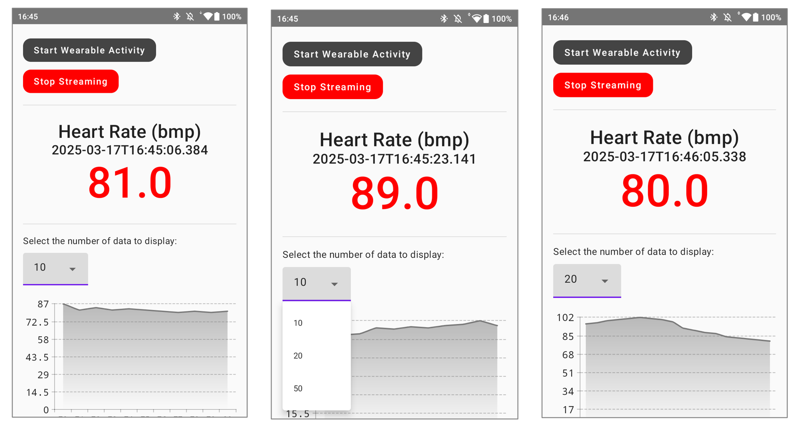

# HRStreamer


HR Streamer facilitates the streaming of heart rate data from a Google Pixel Watch to Unity, via the intermediary relay of an Android smartphone.



---

## Quick Links

- [Description](#description)
  - [Wear/Android side](#wearandroid-side)
  - [Unity side](#unity-side)
  - [Disclaimer](#disclaimer)
- [How to use?](#how-to-use)
  - [Step 1: Pair up watch and phone](#step-1-pair-up-watch-and-phone)
  - [Step 2: Install HRStreamer apps](#step-2-install-hrstreamer-apps)
  - [Step 3: Set up Unity environment](#step-3-set-up-unity-environment)
  - [Step 4: Start streaming](#step-4-start-streaming)
- [Troubleshooting](#troubleshooting)
- [Miscellaneous](#miscellaneous)
  - [Cite the research paper](#cite-the-research-paper)
  - [Lab Homepage](#lab-homepage)
  - [Funding](#funding)

---


# Description
`HRStreamer` is a software ecosystem designed to facilitate the streaming of heart rate data from a Google Pixel Watch to Unity, via an Android smartphone. Data communication between the Wear OS (Pixel Watch) and Android smartphone is achieved using the Wear Data Layer API via BLE. On the Android side, the data is transmitted to Unity using the Lab Stream Layer (LSL) framework. The UI of the Wear OS and Android apps are built using Jetpack Compose.

## Wear/Android side
The system includes a Wear OS companion app on the Pixel Watch and an Android app on the smartphone. These apps use the Wear Data Layer API to stream heart rate data via BLE. The Wear OS app utilizes a [`WearableListenerService`][1] to manage data events, while the Android app uses the [`DataClient.OnDataChangedListener`][2] interface to receive the data.

The system was developed with the following resources:
- [Android DataLayer Sample][3]
- [Composesensor library][4]

For further development, the following IDEs/tools are required:
- Android Studio (with Android SDK and ADB tools installed)
- USB debugging enabled on both the Android phone and the Pixel Watch
- USB cable for device testing

[1]: https://developers.google.com/android/reference/com/google/android/gms/wearable/WearableListenerService
[2]: https://developers.google.com/android/reference/com/google/android/gms/wearable/DataClient
[3]: https://github.com/android/wear-os-samples/tree/main/DataLayer
[4]: https://github.com/mutualmobile/ComposeSensors

## Unity side
To stream heart rate data into Unity, the `LSL4Unity` plugin is required. This plugin can be added to your Unity environment, following the steps outlined in the [LSL4Unity documentation](https://github.com/labstreaminglayer/LSL4Unity). The plugin adds an LSL menu to the Unity editor (`LSL > Show Streams`) that allows you to see available LSL streams.

The heart rate stream from the Android device will appear with the following details:
- **Name**: "HeartRate"
- **Type**: "DataLayer"
- **HostName**: "localhost"
- **DataRate**: 0 (indicating an irregular rate)

The HR data can be accessed in Unity via the LSL Inlet, using C# scripts. A basic example scene that demonstrates how to visualize the heart rate data is available for download: [SampleScene](https://drive.google.com/file/d/18fLuTYfTJ9fL__QcylvnFoN6KLvgBfSw/view?usp=sharing).

### Example LSL Receiver Script
A C# script to receive LSL data is located at `Assets/LSLreceiver.cs`. The example scene that displays heart rate data is located at `Assets/Scenes/SampleScene.unity`.

For more information, visit [LSL4Unity](https://github.com/labstreaminglayer/LSL4Unity).

<!--img src="screenshots/phone_image.png" height="400" alt="Screenshot"/>  


## Disclaimer
The code was tested on the following devices:
- **Wear app**: Google Pixel Watch 2 (Wear OS 4.0)
- **Android app**: OUKITEL WP12 Pro (Android 11)
- **Unity script**: Windows 11 (Unity 2022.3.18f)


# How to use?

### Step 1: Pair up watch and phone
- Pair the Google Pixel Watch with the Android smartphone via the Google Wear OS app.

*Note*: The Wear Data Layer API is the only supported BLE-based communication method between the Pixel Watch and Android phone. If communication needs to be established via Wi-Fi instead of BLE, a different implementation would be required. For more details, see [DataLayer API documentation](https://developer.android.com/training/wearables/data/overview).

### Step 2: Install HRStreamer Apps
- Download and install the [HRStreamer app](https://drive.google.com/file/d/18phEL28fOJgKn4YLVbLwj6y7kFIfTDbR/view?usp=sharing) on both the Android smartphone and the Pixel Watch.

*Note*: Simply open the APK on the Android smartphone and follow the installation steps. The Wear OS companion app will be automatically installed on the paired Pixel Watch. You may need to manually grant permission to install third-party APKs on the Android smartphone by adjusting the Settings.


### Step 3: Set up Unity Environment
- Add the LSL4Unity package to your Unity project. Instructions can be found [here](https://github.com/labstreaminglayer/LSL4Unity).
- (Optional) To view active LSL streams, go to `LSL > Show Streams` in the Unity menu bar.
- A simple example scene to visualize heart rate data is available for download: [SampleScene](https://drive.google.com/file/d/18fLuTYfTJ9fL__QcylvnFoN6KLvgBfSw/view?usp=sharing).

### Step 4: Start Streaming
- Ensure the Pixel Watch is connected to the Android smartphone via BLE.
- Open the HRStreamer Android app and tap "Start Wear Activity" to begin streaming.

# Troubleshooting

### Issue 1: Streaming doesn't start on Android phone
- Ensure the Pixel Watch is properly connected to the Android phone.

### Issue 2: LSL stream not detected by Unity
- Disable the firewall or adjust its settings to allow LSL traffic.

For more help with the network issues, check out the [LSL Network Troubleshooting Guide](https://labstreaminglayer.readthedocs.io/info/network-connectivity.html#wireless-connections).


# Miscellaneous

### Cite the Research Paper

If `HRStreamer` is useful for your research, please consider citing the following paper:

> Liang Z. [Harnessing Consumer Smartwatches for Heart Rate Streaming in Unity Game Engine](https://www.researchgate.net/publication/387920640_Harnessing_Consumer_Smartwatches_for_Heart_Rate_Streaming_in_Unity_Game_Engine). In: *2024 IEEE Consumer Life Tech Conference (ICLT 2024)*. Sydney, Australia; 2024.

BibTeX citation:

```bibtex
@inproceedings{liang2024harnessing,
    author = {Liang, Zilu},
    title = {{Harnessing Consumer Smartwatches for Heart Rate Streaming in Unity Game Engine}},
    booktitle = {2024 IEEE Consumer Life Tech Conference (ICLT 2024)},
    year = {2024}
}
```

This paper also discusses the feasibility and pros/cons of other system architecture designs for the HRStreamer.

### Lab homepage
For more details of this project, as well as other project of our research group, feel free to drop by the homepage of our [ubicomp lab](http://www.ubicomp-lab.org). 

### Funding
This work was supported by the JSPS Grant-in-Aid for Scientific Research (B) (Grant Number: 23K25701)


